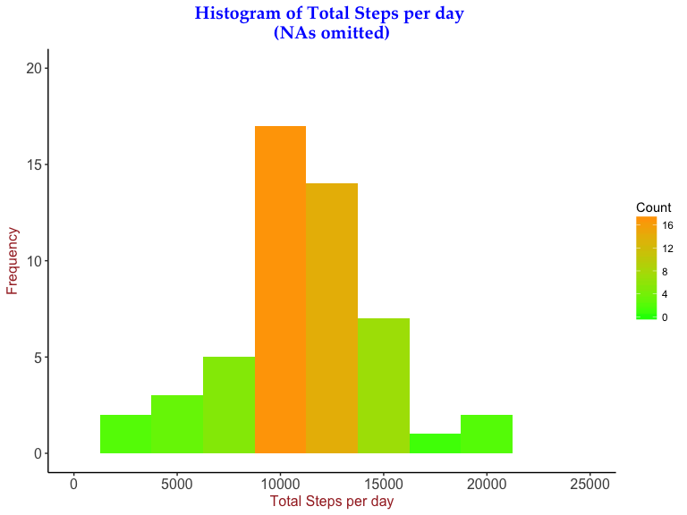

# Reproducible Research: Peer Assessment 1
by Nutty  


```r
# setting global Options as echo=TRUE
```

##<span style="color:blue">Loading and preprocessing the data</span>

1. Load the data (i.e. 𝚛𝚎𝚊𝚍.𝚌𝚜𝚟())

```r
# Reading CSV file from local ZIP file.
actread <- read.csv(unz("activity.zip","activity.csv"),stringsAsFactors = FALSE)
```

2. Process/transform the data (if necessary) into a format suitable for your analysis

```r
# Processing dates and days
actread$date <- as.Date(actread$date, "%Y-%m-%d")
actread$day <- weekdays(actread$date)
actread$weekpart <-
    ifelse((actread$day == "Saturday") |
               (actread$day == "Sunday"),
           "Weekend",
           "Weekday")
```

##<span style="color:blue">What is mean total number of steps taken per day?</span>

1. Calculate the total number of steps taken per day

```r
# Omit NAs
actomitna <- na.omit(actread)

# Calculate Sum by date
stepsum <-
    aggregate(actomitna$steps,
              by = list(actomitna$date),
              sum)
names(stepsum) <- c("Date","steps")
```

2. Make a histogram of the total number of steps taken each day


```r
# Plotting Histogram
library(ggplot2)
par(mar = c(5, 5, 5, 2))
ggplot(stepsum, aes(steps)) +
    geom_histogram(binwidth = 2500, aes(fill = ..count..)) +
    scale_fill_gradient("Count", low = "green", high = "orange") +
    theme(
        panel.background = element_blank(),
        panel.grid.major = element_blank(),
        panel.grid.minor = element_blank(),
        axis.line = element_line(color = "black", size = 0.5),
        axis.text.x = element_text(size = 12),
        axis.title.x = element_text(size = 12, color = "brown"),
        axis.text.y = element_text(size = 12),
        axis.title.y = element_text(size = 12, color = "brown"),
        plot.title = element_text(
            family = "Palatino",
            size = 15,
            face = "bold",
            color = "blue",
            hjust = 0.5
        )
    ) +
    xlim(0, 25000) +
    ylim(0, 20) +
    labs(title = "Histogram of Total steps per day \n(NAs omitted)") +
    xlab("Total Steps Per Day") +
    ylab("Frequency")
```



3. Calculate and report the mean and median of the total number of steps taken per day


```r
# Mean and Median calculation
options(scipen = 1, digits = 2)
actmean <- mean(stepsum[, 2])
actmedian <- median(stepsum[, 2])
```

  
The **MEAN** total number of steps taken per day after removing NA values is **10766.19**   

The **MEDIAN** total number of steps taken per day after removing NA values is **10765**

##<span style="color:blue">What is the average daily activity pattern?</span>

1. Make a time series plot (i.e. 𝚝𝚢𝚙𝚎 = "𝚕") of the 5-minute interval (x-axis) and the average number of steps taken, averaged across all days (y-axis)

```r
# Average steps per interval
avgday <-
    aggregate(actread$steps,
              by = list(actread$interval),
              mean,
              na.rm = TRUE)
names(avgday) <- c("interval","steps")
```


```r
# Time Series plot
library(ggplot2)
par(mar = c(5, 5, 5, 2))
ggplot(avgday, aes(interval, steps)) +
    geom_line(color = "brown") +
    theme(
        panel.background = element_blank(),
        panel.grid.major = element_blank(),
        panel.grid.minor = element_blank(),
        axis.line = element_line(color = "black", size = 0.5),
        axis.text.x = element_text(size = 12),
        axis.title.x = element_text(size = 12),
        axis.text.y = element_text(size = 12),
        axis.title.y = element_text(size = 12),
        strip.text = element_text(size = 12, color = "red"),
        plot.title = element_text(
            family = "Palatino",
            size = 15,
            face = "bold",
            color = "blue",
            hjust = 0.5
        )
    ) +
    labs(title = "Time Series Plot of Average Steps in a 5 mintue interval \n(NAs Removed)") +
    ylab("Average number of steps") +
    xlab("5-Mintue Interval")
```


2. Which 5-minute interval, on average across all the days in the dataset, contains the maximum number of steps?

```r
# Calculate Max value
maxavg <- avgday[which(avgday[,2]==max(avgday[,2])),]
```


The 5-Minute interval which the highest average (206.17) numer of steps is **835**  

##<span style="color:blue">Imputing missing values</span>

1. Calculate and report the total number of missing values in the dataset (i.e. the total number of rows with 𝙽𝙰s)

```r
# NA count
stepsna <- sum(is.na(actread[,1]))
```


**2304** rows have NA values  

2. Devise a strategy for filling in all of the missing values in the dataset. The strategy does not need to be sophisticated. For example, you could use the mean/median for that day, or the mean for that 5-minute interval, etc.


```r
# Imputing average steps per interval to NA vlaues 
actclean <- actread[!is.na(actread$steps), ]
cleanday <-
    aggregate(actclean$steps,
              by = list(actclean$interval),
              mean)
names(cleanday) <- c("interval","avgsteps")
nachunk <- actread[is.na(actread$steps), ]
naimpute <-
    merge(nachunk, cleanday, by.x = "interval", by.y = "interval")
naimpute$steps <- round(naimpute$avgsteps, 0)
```


3. Create a new dataset that is equal to the original dataset but with the missing data filled in.

```r
# Binding new data
actfresh <- rbind(naimpute[,1:5],actclean)
actfresh <- actfresh[order(actfresh$date,actfresh$interval),]
```


4. Make a histogram of the total number of steps taken each day and Calculate and report the mean and median total number of steps taken per day. Do these values differ from the estimates from the first part of the assignment? What is the impact of imputing missing data on the estimates of the total daily number of steps?

```r
# New data calculation
freshstep <-
    aggregate(actfresh$steps,
              by = list(actfresh$date),
              sum)
names(freshstep) <- c("Date","steps")
```


```r
# Plotting New Histogram
library(ggplot2)
par(mar = c(5, 5, 5, 2))
ggplot(freshstep, aes(steps)) +
    geom_histogram(binwidth = 2500, aes(fill = ..count..)) +
    scale_fill_gradient("Count", low = "navy blue", high = "purple") +
    theme(
        panel.background = element_blank(),
        panel.grid.major = element_blank(),
        panel.grid.minor = element_blank(),
        axis.line = element_line(color = "black", size = 0.5),
        axis.text.x = element_text(size = 12),
        axis.title.x = element_text(size = 12, color = "brown"),
        axis.text.y = element_text(size = 12),
        axis.title.y = element_text(size = 12, color = "brown"),
        plot.title = element_text(
            family = "Palatino",
            size = 15,
            face = "bold",
            color = "blue",
            hjust = 0.5
        )
    ) +
    xlim(0, 25000) +
    ylim(0, 25) +
    labs(title = "Histogram of Total steps per day") +
    xlab("Total Steps Per Day") +
    ylab("Frequency")
```


```r
# Mean and Median of new Data
options(scipen = 1, digits = 2)
freshmean <- mean(freshstep[, 2])
freshmedian <- median(freshstep[, 2])

# Difference between new and old values
Impactmean <- actmean-freshmean
Impactmedian <- actmedian-freshmedian
```


The **MEAN** total number of steps taken per day after imputing NA values is **10765.64**   
The **MEDIAN** total number of steps taken per day after imputing NA values is **10762**

The impact of the missing data on the MEAN is **0.55** steps and on the MEDIAN is **3** steps   


##<span style="color:blue">Are there differences in activity patterns between weekdays and weekends?</span>

1. Create a new factor variable in the dataset with two levels – “weekday” and “weekend” indicating whether a given date is a weekday or weekend day.

```r
# New factor variable
# Note: We are using the imputed data for NA values here
weekact <-
    aggregate(actfresh$steps,
              by = c(list(actfresh$interval), list(actfresh$weekpart)),
              mean)
names(weekact) <- c("interval", "weekpart", "steps")
weekact$weekpart <- as.factor(weekact$weekpart)
```


2. Make a panel plot containing a time series plot (i.e. 𝚝𝚢𝚙𝚎 = "𝚕") of the 5-minute interval (x-axis) and the average number of steps taken, averaged across all weekday days or weekend days (y-axis). See the README file in the GitHub repository to see an example of what this plot should look like using simulated data.


```r
# New time Series Plot
library(ggplot2)
par(mar = c(5, 5, 5, 2))
ggplot(weekact, aes(interval, steps)) +
    geom_line(color = "purple") +
    theme(
        panel.background = element_blank(),
        panel.grid.major = element_blank(),
        panel.grid.minor = element_blank(),
        axis.line = element_line(color = "black", size = 0.5),
        axis.text.x = element_text(size = 12),
        axis.title.x = element_text(size = 12,color="brown"),
        axis.text.y = element_text(size = 12),
        axis.title.y = element_text(size = 12,color="brown"),
        strip.text = element_text(size = 12, color = "black"),
        strip.background = element_rect(fill = "light gray"),
        plot.title = element_text(
            family = "Palatino",
            size = 15,
            face = "bold",
            color = "blue",
            hjust = 0.5
        )
    ) +
    facet_wrap(~weekpart,ncol = 1,nrow = 2,as.table = F) +
    labs(title = "Time Series Plot of Average Steps in a 5 mintue interval \n Comparison between Weekday and Weekend data") +
    ylab("Average number of steps") +
    xlab("5-Mintue Interval")
```


 <center>   ---END OF CODE---</center>

